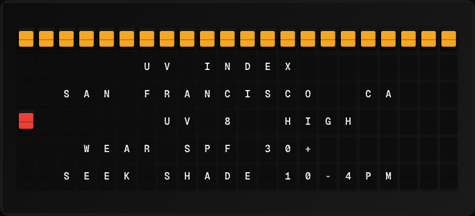

# UV Index Plugin

Display the current UV index and sun protection advice using Open-Meteo.



**→ [Setup Guide](./docs/SETUP.md)**

## Overview

The UV Index plugin queries the Open-Meteo Air Quality API for current UV index data at a configured latitude/longitude. It calculates sun-protection advice (SPF recommendation, shade needed) from the UV value. No API key required.

## Template Variables

| Variable | Description | Example |
|---|---|---|
| `uv_index.uv_index` | Current UV index value | `7.2` |
| `uv_index.risk_level` | UV risk level (Low/Moderate/High/Very High/Extreme) | `High` |
| `uv_index.protection` | Recommended protection (e.g. SPF 30+) | `SPF 30+, seek shade` |

## Example Templates

```
UV INDEX
UV: {{uv_index.uv_index}}
Risk: {{uv_index.risk_level}}
{{uv_index.protection}}


```

## Configuration

| Setting | Name | Description | Required |
|---|---|---|---|
| `latitude` | Latitude | Location latitude (decimal degrees). | No |
| `longitude` | Longitude | Location longitude (decimal degrees). | No |

## Features

- Open-Meteo UV index (no API key)
- Risk level categorization
- Sun protection advice
- Configurable location

## Author

FiestaBoard Team
